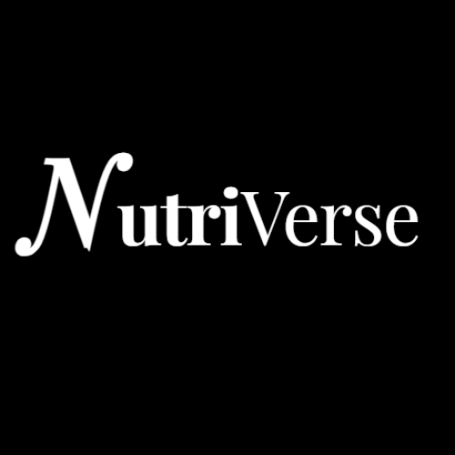
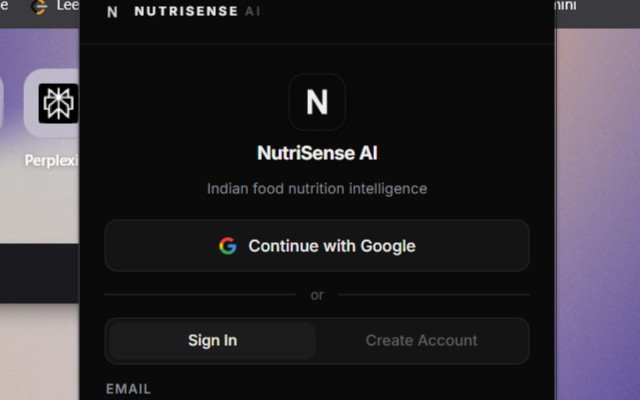
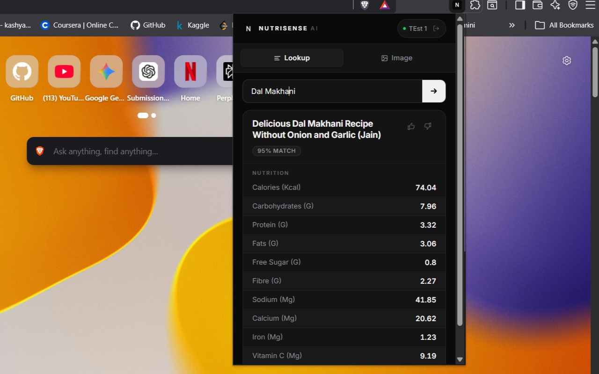
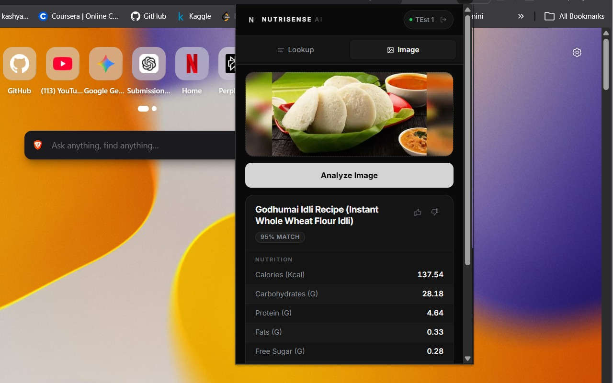
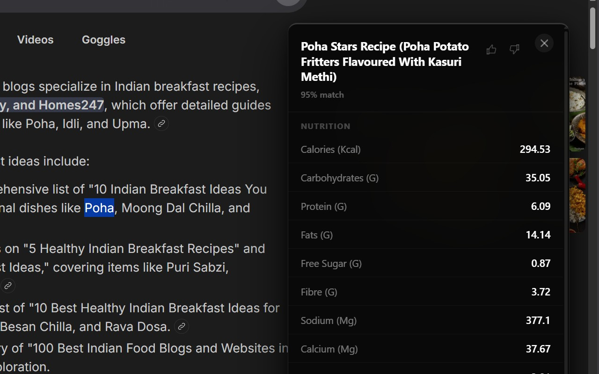
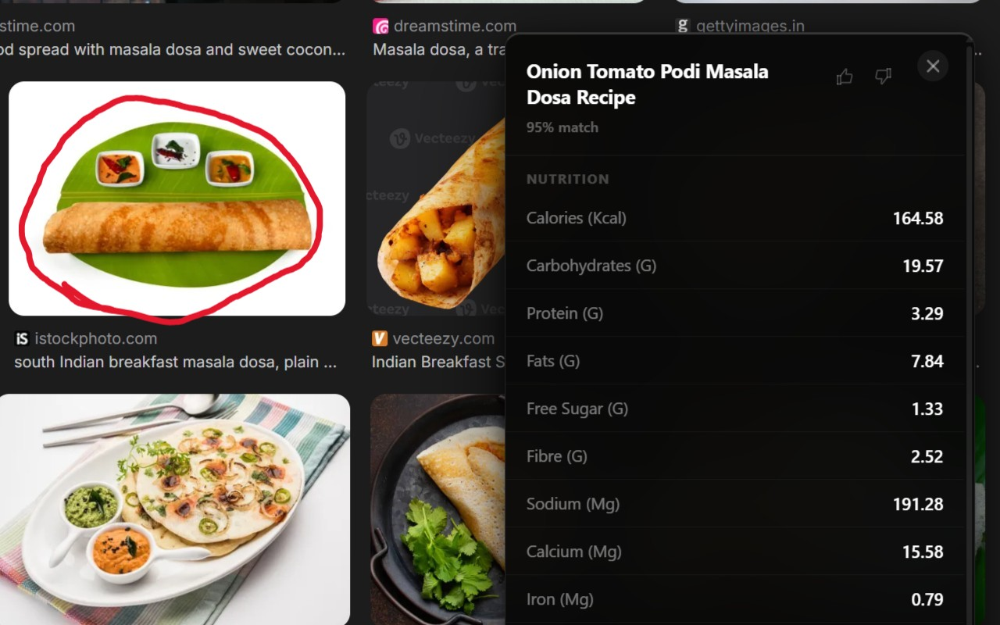

<div align="center">



# NutriVerse

**AI nutrition intelligence for Indian cuisine.**

Look up any dish, classify a meal from a photo, and cook hands-free with a voice kitchen assistant — backed by a curated food knowledge graph.

[](https://apps.microsoft.com/)
[](https://chromewebstore.google.com/)
[](#)
[](#)
[](#)
[](#)
[](#)
[](LICENSE)

</div>

---

## Table of Contents

- [Overview](#overview)
- [Features](#features)
- [Screenshots](#screenshots)
- [Architecture](#architecture)
- [Tech Stack](#tech-stack)
- [Repository Structure](#repository-structure)
- [Installation](#installation)
- [Environment Variables](#environment-variables)
- [Running Locally](#running-locally)
- [API Reference](#api-reference)
- [Models](#models)
- [Knowledge Graph](#knowledge-graph)
- [Distribution](#distribution)
- [License](#license)
- [Author](#author)

---

## Overview

**NutriVerse** is a full-stack AI nutrition assistant focused on Indian cuisine. Most nutrition apps are built around Western foods — Indian dishes are missing, inaccurately estimated, or buried under generic categories. NutriVerse closes that gap with a curated recipe and food-product knowledge graph, a vision model trained on Indian dishes, and a conversational layer that handles cooking-time questions in natural language.

The product ships across three surfaces from a single codebase:

- **Desktop** — Electron application distributed via the Microsoft Store and as an NSIS installer.
- **Browser extension** — Right-click any food image on the web for instant nutrition; live on the Chrome Web Store.
- **Web** — The same React SPA served directly from the FastAPI backend.

A standalone **phone-only kitchen mode** turns any smartphone into a hands-free cooking coach using WebSocket voice streaming and server-side speech-to-text.

---

## Features

### Nutrition intelligence
- **Dish lookup** — Type or speak a dish name; receive macros, ingredients, allergens, and a step-by-step recipe.
- **Image classification** — Upload a meal photo (or right-click on the web) for top-3 predictions with confidence scores and full nutrition.
- **Compare dishes** — Side-by-side macro comparison with an LLM-generated summary of which is healthier and why.
- **Healthy swaps** — Lower-calorie, higher-protein, or allergy-safe alternatives drawn from the graph.
- **Recipe modification** — *"Make it vegan"*, *"less oil"*, *"high-protein version"* — the LLM rewrites ingredients and re-estimates nutrition.
- **Semantic search** — Embedding-based GraphRAG search (e.g. *"high-protein vegetarian breakfast"*).

### Conversational and multimodal
- **Product chat** — Follow-up questions on any dish or packaged food.
- **Chef mode** — Walk through a recipe step by step in conversation.
- **Kitchen mode (phone)** — Hands-free voice assistant with WebSocket audio streaming, voice-activity detection, and a multi-stage intent pipeline.
- **PC + phone remote** — QR-code pairing lets a phone drive Chef mode on a PC over WebSocket.

### Personalization
- Like / dislike / cooked tracking modelled as graph relationships.
- Allergen and dietary preferences (`ALLERGIC_TO`, `PREFERS_CUISINE`, `PREFERS_HEALTH_TAG` edges on the user node).
- Hybrid recommender that blends popular content with personalized recommendations as the taste profile grows; rating-weighted "cooked" interactions; search-intent re-ranking using sentence embeddings.
- 3-step onboarding modal for new users (cuisines → health goal → dietary tags).

### Platform
- Email/password and Google OAuth sign-in via Firebase.
- JWT access + refresh tokens with revocation list.
- Per-user LLM rate limiting and prompt-level response caching.
- Static SPA + API served from a single container with security headers, CORS allow-list, and file-upload validation.

---

## Screenshots

<div align="center">

  

 

</div>

---

## Architecture

```
                ┌───────────────────────────────────────────────┐
                │  Surfaces                                     │
                │  • Desktop (Electron, MS Store + NSIS)        │
                │  • Web SPA (React 19 + Vite)                  │
                │  • Chrome Extension (MV3)                     │
                └───────────────────────┬───────────────────────┘
                                        │  HTTPS / WSS
                                        ▼
                ┌───────────────────────────────────────────────┐
                │  FastAPI gateway (Azure App Service)          │
                │  Auth · Rate-limit · Routing · Static SPA     │
                └───┬─────────┬─────────┬──────────┬────────────┘
                    │         │         │          │
                    ▼         ▼         ▼          ▼
              Intent       Vision    GraphRAG    Voice / STT
              Router      classifier (embeddings)  pipeline
                    │         │         │          │
                    └────┬────┴────┬────┴────┬─────┘
                         ▼         ▼         ▼
                ┌──────────────┐ ┌─────────────┐ ┌────────────┐
                │  Neo4j Aura  │ │  LLM (Groq) │ │  Storage   │
                │  Knowledge   │ │  Llama 3.3  │ │  (Azure FS)│
                │  Graph       │ │  + Gemini   │ │            │
                └──────────────┘ └─────────────┘ └────────────┘
```

A single FastAPI process serves the React build, the JSON API, and the WebSocket endpoints for voice and kitchen modes. The intent **Router** classifies each query as a lookup, comparison, modification, semantic search, or freeform chat, then dispatches it to the appropriate pathway.

---

## Tech Stack

**Frontend**
- React 19, TypeScript, Vite 6
- Tailwind CSS (CSS-variable theme tokens), Framer Motion
- React Router v7, native `fetch`, React Context for state
- Firebase Web SDK, `@react-oauth/google`
- Electron 31, `electron-builder` for NSIS and APPX targets

**Backend**
- Python 3.11, FastAPI, Uvicorn
- Pydantic v2, JOSE JWT, Firebase Admin
- WebSocket endpoints for voice, kitchen, and chef-remote sessions
- `cachetools` for LLM response caching, custom per-user rate limiter

**AI / ML**
- Image classifier: **ConvNeXt-Small** (`timm`, PyTorch), 239 Indian food classes
- Speech-to-text: **faster-whisper** (`small.en`, int8, CPU)
- Embeddings: **sentence-transformers** (`all-MiniLM-L6-v2`)
- LLMs: **Groq** (`llama-3.3-70b-versatile`) for chat and voice; **Gemini** (`gemini-2.0-flash`) for structured-output paths

**Data**
- **Neo4j Aura** knowledge graph (recipes, ingredients, food products, brands, categories, allergens, image classes, users)
- Full-text indexes on recipe and product names; range indexes on ids; uniqueness constraint on `User.id`

**Distribution**
- Microsoft Store (APPX), NSIS installer, Chrome Web Store
- Backend: Docker → Azure App Service (Southeast Asia)

---

## Repository Structure

```
NutriSense-AI/
├── Backend/              FastAPI app (api/, core/, dependencies/, schemas/)
├── Src/                  ML & domain library
│   ├── Image_classifier/   ConvNeXt training, inference, model checkpoint
│   ├── LLM/                Groq / Gemini clients, caching, engine
│   ├── Pathway_1/          Fuzzy recipe + product lookup
│   ├── Router/             Intent router
│   ├── services/           GraphRAG, recommender
│   └── neo4j_client.py     All Cypher lives here
├── frontend/             React 19 + Vite + Electron desktop wrapper
├── Extension/            Chrome MV3 extension
├── data/                 Persistent reports / feedback CSVs
├── Notebooks/            Training & exploration notebooks
├── tests/                Pytest suite
├── Dockerfile            Multi-stage build (frontend + backend in one image)
├── run.py                Local entrypoint
└── requirements.txt
```

---

## Installation

### Prerequisites
- Python **3.11**
- Node.js **20+**
- A Neo4j Aura (or self-hosted Neo4j 5.x) instance with the recipe graph loaded
- API keys: **Groq**, **Gemini** (optional), **Firebase** project + service account

### Setup

```bash
git clone https://github.com/KAshyapk07/NutriSense-AI.git
cd NutriSense-AI

# Backend
python -m venv .venv
.venv\Scripts\activate           # Windows PowerShell
pip install -r requirements.txt

# Frontend
cd frontend
npm install
cd ..
```

The image classifier checkpoint is pulled from Hugging Face on first run (or pre-baked into the Docker image). See [Models](#models).

---

## Environment Variables

Create a `.env` file at the project root. Only the variables relevant to your deployment surface are required.

| Variable | Purpose |
| --- | --- |
| `NEO4J_URI` | Bolt URI for the knowledge graph (e.g. `neo4j+s://xxxx.databases.neo4j.io`) |
| `NEO4J_USER` | Neo4j username |
| `NEO4J_PASSWORD` | Neo4j password |
| `GROQ_API_KEY` | Groq API key (chat, voice, processing) |
| `GROQ_MODEL` | Default `llama-3.3-70b-versatile` |
| `GEMINI_API_KEY` | (Optional) Gemini key for structured-output paths |
| `GEMINI_MODEL` | Default `gemini-2.0-flash` |
| `AUTH_SECRET_KEY` | JWT signing key (32+ random bytes) |
| `AUTH_ACCESS_TOKEN_MINUTES` | Access token TTL (default `15`) |
| `AUTH_REFRESH_TOKEN_DAYS` | Refresh token TTL (default `180`) |
| `FIREBASE_SERVICE_ACCOUNT_JSON` *or* `FIREBASE_SERVICE_ACCOUNT_PATH` | Firebase Admin credentials |
| `FIREBASE_PROJECT_ID` | Firebase project id |
| `ALLOWED_ORIGINS` | Comma-separated CORS allow-list |
| `PUBLIC_URL` | Externally reachable base URL (used for Chef-Remote QR codes) |
| `SERVE_STATIC` | `true` to serve the SPA from FastAPI (default), `false` if behind a CDN |
| `FRONTEND_DIR` | Path to the built SPA (default `frontend/dist`) |
| `MAX_CONTENT_MB` | Upload limit (default `16`) |
| `REPORT_ADMIN_TOKEN` | Token guarding `/report/download` and `/ai-feedback/download` |
| `REPORT_DIR` | Directory for issue-report CSVs (e.g. `/home/data/reports` on Azure) |

Frontend (build-time, Vite):

| Variable | Purpose |
| --- | --- |
| `VITE_API_URL` | Backend base URL (leave empty to use same origin) |
| `VITE_FIREBASE_API_KEY` etc. | Standard Firebase web config |

---

## Running Locally

### Backend (FastAPI)

```bash
python run.py
# or:
uvicorn Backend.main:app --reload --port 8000
```

OpenAPI docs are available at `http://localhost:8000/docs`.

### Frontend (Vite dev server)

```bash
cd frontend
npm run dev
```

Open `http://localhost:5173`. The dev server proxies API calls to the backend; in production the same FastAPI process serves the built SPA.

### Desktop (Electron)

```bash
cd frontend
npm run desktop          # run Electron against the dev build
npm run dist:win         # produce an NSIS installer
npm run dist:appx        # produce a Microsoft Store APPX
npm run dist:all         # both targets
```

### Docker (full stack)

```bash
docker build -t nutriverse .
docker run -p 8000:8000 --env-file .env nutriverse
```

The multi-stage `Dockerfile` builds the frontend, installs Python dependencies, pre-downloads the vision and STT models, and exposes a `/health` healthcheck.

---

## API Reference

The HTTP surface is small and deliberate. All authenticated routes accept a `Bearer` JWT.

| Method | Path | Purpose |
| --- | --- | --- |
| `GET` | `/health` | Liveness check |
| `GET` | `/config` | Returns `PUBLIC_URL` for QR-code pairing |
| `POST` | `/process` | Multimodal entrypoint — text, image, or both → routed pathway |
| `GET` | `/search` | Semantic / GraphRAG search |
| `POST` | `/chat` | Conversational follow-ups |
| `POST` | `/chef/parse` · `/chef/intent` | Chef-mode parsing and intent classification |
| `POST` | `/auth/login` · `/auth/refresh` · `/auth/logout` | Auth lifecycle |
| `GET/PUT` | `/users/me` (profile, allergens, preferences, interactions, recommendations, cooked, export) | User domain |
| `POST/DELETE` | `/users/me/{liked,disliked,viewed,cooked}/{item_id}` | Interaction events |
| `POST` | `/report` · `/report/feedback` | Issue / feedback submission |
| `POST` | `/ai-feedback` | LLM-response feedback |
| `WS` | `/ws/kitchen/{session_id}` | Phone-only voice kitchen session |
| `WS` | `/ws/chef-voice/{session_id}` | Chef-remote voice channel |

Schemas live under `Backend/schemas/`. Full interactive docs: `/docs` and `/redoc`.

---

## Models

**Image classification — ConvNeXt-Small**
- Backbone: `convnext_small.fb_in22k_ft_in1k` from `timm`, fine-tuned for **239 Indian food classes**.
- Custom classification head: `LayerNorm → Dropout(0.3) → Linear(in→512) → GELU → Dropout(0.2) → Linear(512→num_classes)`, `drop_path_rate=0.2`.
- Inference transform: `Resize(256) → CenterCrop(224) → ToTensor → ImageNet normalize`.
- Returns top-K predictions with confidence; classes map directly to `ImageClass` nodes in the graph for instant nutrition lookup.
- Checkpoint hosted on Hugging Face (`Kashyapk07/NutriSense_ConvNext_Small_Best`) and pulled at container build.

**Speech-to-text — faster-whisper**
- Model `small.en`, `int8` quantization, CPU.
- Streaming audio over WebSocket (WebM/Opus, 250 ms chunks) with a `WebmAccumulator` for reliable multi-utterance decoding.
- Voice-activity detection with a 0.75 s gap threshold; cooking-vocabulary prompt biases Whisper toward recipe-specific terms.

**LLM stack**
- **Groq** Llama 3.3 70B Versatile is the production LLM for chat, voice, and processing — wrapped in a `CachedLLMClient` and gated by a per-user rate limiter.
- **Gemini 2.0 Flash** handles structured-JSON and reasoning paths.
- The intent **Router** runs cheap regex and keyword gates before falling back to the LLM, keeping latency and token spend low for the common case.

---

## Knowledge Graph

NutriVerse is built around a Neo4j graph that captures dishes, ingredients, packaged products, allergens, and user behaviour in one place.

**Node labels**
- `Recipe` — Indian dishes with macros, instructions, tags
- `Ingredient` — Raw ingredients linked to recipes
- `FoodProduct` — Packaged / commercial foods
- `Brand` — Manufacturer brands
- `Category` — Product categories
- `AllergenTag` — Allergen taxonomy (peanut, gluten, dairy, …)
- `ImageClass` — Maps each vision-model class to a `Recipe`
- `Cuisine`, `HealthTag` — Preference taxonomy
- `User` — Authenticated user
- `SearchEvent` — Logged queries used to seed the recommender

**Relationships**
- `(Recipe)-[:CONTAINS]->(Ingredient)`
- `(Ingredient)-[:IS_ALLERGEN]->(AllergenTag)`
- `(FoodProduct)-[:MADE_BY]->(Brand)`, `(FoodProduct)-[:IN_CATEGORY]->(Category)`
- `(ImageClass)-[:MAPS_TO]->(Recipe)`
- `(User)-[:VIEWED|LIKED|DISLIKED|COOKED]->(Recipe|FoodProduct)`
- `(User)-[:ALLERGIC_TO]->(AllergenTag)`
- `(User)-[:PREFERS_CUISINE]->(Cuisine)`, `(User)-[:PREFERS_HEALTH_TAG]->(HealthTag)`
- `(User)-[:PERFORMED]->(SearchEvent)`

Indexes are created idempotently on startup (recipe and product id, user-id uniqueness, full-text on recipe names).

---

## Distribution

- **Microsoft Store** — Published as **NutriVerse** under Health & fitness; APPX built via `electron-builder` with Partner Center identity wired into `frontend/package.json`.
- **NSIS installer** — Single-file `.exe` for users outside the Store.
- **Chrome Web Store** — MV3 extension in `Extension/`; right-click any image on any page to classify it via the production backend.
- **Backend** — Docker image deployed to **Azure App Service** (Southeast Asia). Persistent storage uses Azure Files mounts for issue-report and feedback CSVs.

The repository ships:
- `Dockerfile` — multi-stage build that bundles frontend, backend, and models in one image.
- `validate-docker.sh` — sanity check for the production image.
- Health checks at `/health`, security headers on every response, HSTS in production.

---

## License

Released under the **MIT License** — see [`LICENSE`](LICENSE).

The trained model weights, recipe dataset, and brand assets (icons, store listings) are **not** covered by the MIT License and remain © 2026 Kashyap K. Contact for any commercial reuse.

---

## Author

**Kashyap K** — built and maintained as a solo project. Issues and pull requests are welcome.

- Microsoft Store: *NutriVerse*
- Chrome Web Store: *NutriVerse*
- GitHub: [`@KAshyapk07`](https://github.com/KAshyapk07)
