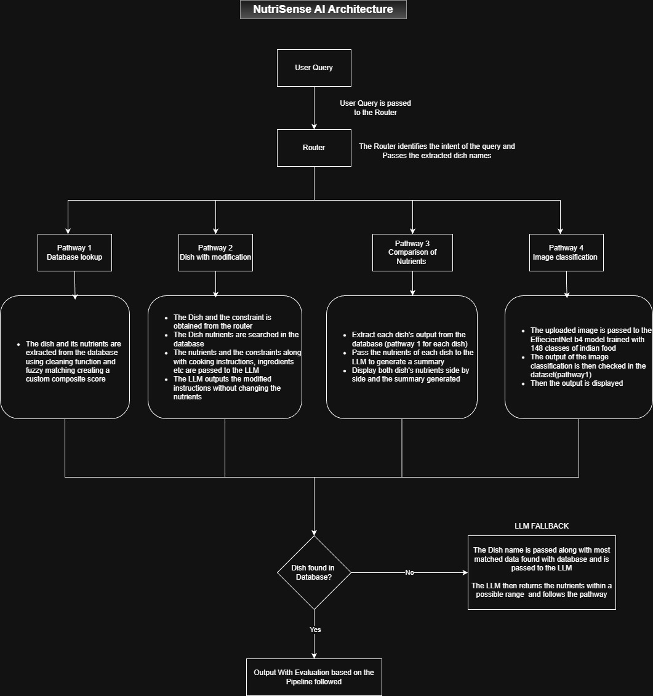

# NutriSense-AI — Comprehensive Project Status & Roadmap


A comprehensive AI system analyzing Indian food recipes through database lookup, recipe modification, nutritional comparison, and image classification to provide dietary insights. Designed to provide accurate nutritional guidance for Indian cuisine with fallback estimation capabilities.

## Table of Contents

- [Overview](#overview)
- [Why This Matters](#why-this-matters)
- [Features](#features)
- [System Architecture](#system-architecture)
- [Dataset](#dataset)
- [Installation](#installation)
- [Usage](#usage)
- [Tech Stack](#tech-stack)
- [Model Performance](#model-performance)
- [Blogs](#blogs)
- [Future Enhancements](#future-enhancements)
- [Author](#author)
- [License](#license)

## Overview

NutriSense AI is an end-to-end AI system for analyzing Indian food nutrition using
database lookup, image classification, and intelligent recipe modifications.
It addresses the lack of accurate Indian food representation in commercial nutrition APIs.

The system unifies multiple data sources and AI techniques to provide:
- Database-driven lookups for 725+ curated recipes with complete nutritional profiles
- Intelligent image classification across 148 Indian dish categories
- AI-powered recipe modifications (e.g., "low-calorie version of Paneer Butter Masala")
- Multi-recipe comparison with optional nutritional summaries
- Fallback LLM estimation for out-of-database queries

## Why This Matters

- Domain Gap: Indian cuisines are underrepresented in commercial nutrition APIs
- Data Fusion: Unified heterogeneous datasets using custom fuzzy matching (Nutritional values + Cooking methods/Ingredients)
- Multi-Modal Access: Users can query via text or images


## Features

### 1. Database Lookup (Pathway 1)

- Direct extraction of recipes and nutritional information from the unified dataset
- Cleaning and fuzzy matching for accurate recipe identification
- Custom composite scoring for ranking results
- Returns complete nutritional breakdown for queried dishes

### 2. Recipe Modification (Pathway 2)

- Router passes the extracted dish and constraint from the query
- The obtained dish is extracted from the database
- the data from the database and the user constraint are passed to LLM engine
- The LLM engine generates modified instructions while maintaining nutritional accuracy
- Preserves dish authenticity while meeting dietary requirements

### 3. Nutritional Comparison (Pathway 3)

- Compare nutritional profiles of two recipes side-by-side
- Displays macro/micronutrient breakdown for both
- LLM-generated summary highlighting the healthier option
- Helps users make informed dietary choices

### 4. Image Classification (Pathway 4)

- Upload food images for automatic dish recognition
- **ConvNeXt-Small** (timm `convnext_small.fb_in22k_ft_in1k`) fine-tuned on a **148-class Indian food image dataset**
- Returns top-3 predictions; each candidate is looked up in the database in order and the first hit is returned with the full nutritional profile
- All three image predictions are attached to the response under `meta.image_predictions`
- Top-1 accuracy: 86.98% | Top-3 accuracy: 97.10% | Top-5 accuracy: 98.49%

### 5. Router 

- The Router classifies the user query intent using an LLM
- Handles the execution of all the pathways(1,2 & 3)
- Extracts the dish mentioned by the user using LLM

### 6. LLM Fallback Estimator

- Intelligent fallback when dishes aren't found in the database
- Obtains most similar dish from the database (uses Pathway 1)
- Uses LLM to estimate the range of plausible nutrition for the dish
- Clearly marked with lower confidence with warnings

## System Architecture



This diagram illustrates the high-level architecture of NutriSense AI, including
query routing, database lookup, image classification, LLM-powered reasoning,
and fallback estimation pathways.

## Dataset

### 1. The Unified Food Dataset 

This dataset contains 725 curated Indian dishes, where each row links a recipe to its detailed nutrient profile. It was created by cleaning and fuzzy-matching two independent sources one with recipes and another with nutritional information using a custom composite score based on multiple string matching metrics and token overlap.

```bash
 composite = (
            WEIGHT_TOKENSET * token_set_score +
            WEIGHT_WRATIO  * wratio_score +
            12 * ft_score
        ) * (0.7 + 0.3 * overlap_factor) - neg_penalty
```

Dataset 1: [Indian Food Nutritional Values Dataset (2025)](https://www.kaggle.com/datasets/batthulavinay/indian-food-nutrition?source=post_page-----22eb05a4c278---------------------------------------)

Dataset 2: [Indian Food Recipes Dataset (Cleaned Version)](https://www.kaggle.com/datasets/sooryaprakash12/cleaned-indian-recipes-dataset?source=post_page-----22eb05a4c278---------------------------------------)

The unified dataset contains 

- 725 curated indian recipes
- 15+ nutritional attributes (Calories, Protein, Fat, Carbs, Fiber, Sodium, Iron, Calcium, Vitamin A, Vitamin C, etc.)
- Ingredients used
- Cooking Method / Instructions
- Time to prepare the dish
- Regional cuisines

***The Unified Dataset :*** [NutriSense AI Dataset](https://www.kaggle.com/datasets/kashyap077/indian-recipes-ingredients-nutrition-and-cooking) 

### 2. The Image Dataset 

This dataset is used to train the image classification model (ConvNeXt-Small) for Indian food classification.
**The dataset contains 20136 images across 148 classes**. The dataset is split into train (75%), validation (15%), and test (10%) sets using stratified sampling.

***Image Dataset*** : [Indian Food Images for Model Fine-Tuning 2026](https://www.kaggle.com/datasets/kashyap077/indian-food-images-for-model-fine-tuning-2026)
**This dataset was not uploaded into the repo due to very large size**

## Installation 

### Prerequisites:

- Python 3.9+
- Neo4j Desktop (local) or AuraDB
- Node.js (for React frontend)
- Ollama (for local LLM)

```bash
# Clone the repository
git clone https://github.com/KAshyapk07/NutriSense-AI.git
cd nutrisense-ai

# Create virtual environment
python -m venv venv
venv\Scripts\activate

# Install dependencies
pip install -r requirements.txt

# Download the dataset 
# Place the Image dataset in the Data / Images folder

# Install Llama model 
```
### Usage

**1. Start the Backend (FastAPI)**
```bash
python run.py
```

**2. Start the Frontend (React)**
```bash
cd frontend
npm install
npm run dev
```

## Tech Stack

- **Backend**: FastAPI, Python 3.9+
- **Frontend**: React, Vite, Tailwind CSS
- **Database**: Neo4j (Knowledge Graph)
- **AI/ML**: Ollama (Llama 3.2 local inference), ConvNeXt-Small via timm (Image Classification)
- **Data Validation**: Pydantic (Structured LLM Outputs)
- **Testing**: Pytest, Pytest-Asyncio (116+ tests)
- **Fuzzy Matching**: RapidFuzz

## Model Performance

The image classification model is a ConvNeXt-Small backbone (pretrained on ImageNet-22k, fine-tuned on ImageNet-1k via timm) with a custom classification head trained for 50 epochs on the Indian food image dataset. Training used Mixup/CutMix augmentation, EMA, cosine LR schedule with linear warmup, and stochastic depth.

#### Test-Set Performance (best checkpoint — epoch 49)

- Top-1 accuracy: 86.98%
- Top-3 accuracy: 97.10%
- Top-5 accuracy: 98.49%
- Macro F1: 0.7740
- Weighted F1: 0.8756
- Best validation accuracy: 87.34%
- Training time: ~528 minutes (2x GPU)

## Blogs 

I documented the key technical components of this project in detailed blog posts:

- **Building an EfficientNet Image Classification Model With GPU Acceleration**  
   [Read the blog](https://medium.com/@kashyapkumar1234567890/building-an-efficientnet-image-classification-model-with-gpu-acceleration-999fd95fe926)

- **How I Cleaned and Unified Two Messy Indian Food Datasets Into One High Quality Dataset**    
   [Read the blog](https://medium.com/@kashyapkumar1234567890/how-i-cleaned-and-unified-two-messy-indian-food-datasets-into-one-high-quality-dataset-for-my-22eb05a4c278)

## Future Enhancements

- **Phase 3: GraphRAG & Vector Search**: Hybrid retrieval using vector embeddings and graph structure.
- **Phase 4: React Frontend Upgrade**: Complete the transition to a modern React UI.
- **Phase 5: AI Chef Agent**: Interactive step-by-step cooking companion.
- **Phase 6: Authentication & User Graph**: Personalized recommendations and history tracking.
- **Phase 7: AI & ML Enhancements**: Data augmentation, fine-tuning, and RAG exploration.
- **Phase 8: Production & Deployment**: Docker containerization, cloud deployment, and CI/CD.

## Author

**Kashyap K** : kashyapk1305@gmail.com

## License

Code in this repository is licensed under the **MIT License**. See the [`LICENSE`](LICENSE) file for full text.

**Dataset Licenses:**
- Recipe source (Unified dataset): CC BY NC SA 4.0
- Nutrition source: Unknown (used for research/educational purposes only)


The unified recipe–nutrition dataset must **not** be used as a medical or clinical nutrition reference.
